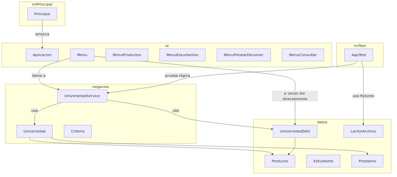

[](https://classroom.github.com/open-in-codespaces?assignment_repo_id=21594808)


# Proyecto - Gestión de Préstamos Universitarios

Este repositorio contiene una aplicación educativa para gestionar préstamos de
productos (instrumentos musicales, materiales deportivos y artículos escénicos)
en una universidad. El proyecto está escrito en Java (Java 11) y organizado en
capas: datos (persistencia/DAO), negocios (dominio y servicios) y UI (menús CLI).

## Actualizaciones recientes (2025-11-04)

Se han aplicado correcciones y mejoras en la sincronización entre la capa en
memoria y los ficheros de persistencia (préstamos). Puntos clave:

- `UniversidadService` importa al iniciar los préstamos persistidos en
  `prestamos.txt` y marca los `Producto` correspondientes como prestados si
  el préstamo está activo (fechaDevolucion vacía). Esto sincroniza la UI con
  el estado en disco.
- Al prestar un producto, el servicio persiste el préstamo en
  `prestamos.txt` mediante `UniversidadDAO.guardarPrestamo(...)`.
- Al devolver un producto, el servicio actualiza el `Prestamo` en memoria y
  escribe la `fechaDevolucion` en el fichero de préstamos. Además llama a
  `UniversidadDAO.persistirProductos(...)` para que la bandera `prestado` de
  los productos quede sincronizada en disco.
- La UI valida ahora, antes de crear un préstamo, si existe un préstamo
  activo persistido para ese producto y evita prestar si la devolución no
  está registrada.

Recomendación para próximas iteraciones: cambiar la estrategia actual
"limpiar y reescribir" por una actualización en sitio (editar la línea
concreta del préstamo) para preservar historial y reducir operaciones de I/O.

Estado de tests: la suite se ejecutó con éxito en la verificación más
reciente.

## Cambios principales

Breve resumen de las mejoras aplicadas en esta entrega (sin historial detallado):

- El dominio usa la clase `Producto` (familias: `MUSICALES`, `DEPORTIVOS`, `ESCENICOS`).
- Los préstamos se persisten desde la capa de servicio (`UniversidadService`) y se almacenan en `prestamos.txt`.
- `UniversidadDAO` gestiona la persistencia en archivos con una cache por familia y soporta eliminación persistente de productos y estudiantes.
- Fixtures de prueba aislados en `src/miTest/archivos` y carga automática en modo pruebas (`usuario.properties`).
- UI reorganizada en menús específicos para productos, estudiantes y operaciones de préstamo/devolución.

### Búsqueda: índice invertido (token → productos)

Esta versión incorpora un índice invertido simple para búsquedas por palabra clave (token). El índice mapea tokens normalizados a conjuntos de `Producto` y permite búsquedas rápidas por palabra, p. ej. "guitarra" devolverá productos musicales con esa palabra en su nombre.

- Implementación: la búsqueda está expuesta por `Universidad.buscarProductosPorPalabraClave(String)` y validada por tests en `src/miTest/PersistenciaIndexTest.java`.
- Estructura interna: se usa una estructura tipo `HashMapCombinada<String,Producto>` (un map de tokens a colecciones de productos).

Estado actual: el índice invertido se construye en memoria al iniciar la aplicación
(indexando todos los productos cargados desde los ficheros). En el código actual
el índice se actualiza inmediatamente cuando se agrega un producto
(método interno `indexarProducto(...)`) y cuando se elimina un producto
(método interno `desindexarProducto(...)`).

Nota: hoy no existe una operación de edición de producto que reindexe el
índice automáticamente. Si se añade la funcionalidad de editar nombre o
descripción debe aplicarse la secuencia `desindexarProducto` → mutación →
`indexarProducto` (o una actualización incremental del índice) para mantener
la consistencia.

### Índice invertido — implementación y ubicación

Detalles concretos sobre la implementación del índice invertido y dónde se
realiza la indexación en el código:

- Clase que implementa el mapa invertido:
  - `src/negocios/utilidades/hashMapCombinada/HashMapCombinada.java` — es una
    implementación ligera que encapsula un `java.util.HashMap<String, LinkedList<T>>`.
    Internamente mantiene:
    - `Map<String, LinkedList<T>> tabla` — el mapa principal (usa `HashMap`).
    - `Vector<String> claves` — para iterar sobre claves si es necesario.
  - Métodos relevantes: `poner(String key, T elm)`, `obtener(String key)`,
    `quitar(String key, T elm)` y `contiene(String key, T elm)`.

- Dónde se construye y actualiza el índice:
  - `src/negocios/Universidad.java` — atributo `indicePalabras` de tipo
    `HashMapCombinada<Producto>`.
  - En el constructor de `Universidad` se crea `indicePalabras = new HashMapCombinada<>()`
    y se llama a `indexarProducto(...)` para cada producto cargado desde los
    ficheros (ver los bucles que recorren `productosDeportivos`, `productosEscenicos`
    y `productosMusicales`).
  - Método `indexarProducto(Producto)` (en `Universidad`) tokeniza el nombre y
    descripción del producto (`TextUtil.tokens(...)`) y usa `indicePalabras.poner(token, producto)`
    para agregar el producto a la lista asociada a cada token.
  - Método `desindexarProducto(Producto)` elimina un producto de las listas
    asociadas a sus tokens (`indicePalabras.quitar(token, producto)`).

- Uso en operaciones dinámicas:
  - Al agregar o eliminar un producto en tiempo de ejecución, la lógica llama
    a `indexarProducto` o `desindexarProducto` respectivamente para mantener el índice
    actualizado.
  - Las búsquedas por clave (`buscarProductosPorPalabraClave`) consultan el
    `indicePalabras.obtener(token)` y transforman la `LinkedList<Producto>` resultante
    a una `ListaDoble<Producto>` para consumo por la UI o servicios.

Resumen: el índice invertido es un `HashMap` de listas ligadas (implementado en
`HashMapCombinada`) y la indexación se realiza en `Universidad.indexarProducto(...)`
durante la carga inicial y cuando se agregan/eliminan productos.

### Editar Estudiantes (UI)

La opción de editar estudiantes está disponible desde el menú principal (ahora en la opción 6). El flujo de edición actual permite modificar nombre, email, fecha de nacimiento, sexo y programa. Los cambios persisten en los ficheros de prueba/producción a través de `UniversidadService` → `UniversidadDAO`.

- Uso: desde el menú principal seleccione la opción 6 y siga las indicaciones para ingresar el código del estudiante y los nuevos valores.
- Nota: la validación actual es básica; puede mejorarse (por ejemplo, validación de formato de email) en futuras iteraciones.

### Estado de edición de Productos

En esta versión NO está implementada la funcionalidad de "Editar Producto". Solo están disponibles: agregar, eliminar y mostrar productos. La edición de productos está planificada para futuras entregas.

## Estructura clave del proyecto

- `src/datos`: modelos (Producto, Estudiante, Prestamo), `UniversidadDAO`, `LectorArchivo`.
- `src/negocios`: dominio (`Universidad`) y servicio (`UniversidadService`).
- `src/uI`: menús CLI y `Aplicacion` (autenticación).
- `src/miTest`: pruebas y fixtures (carpeta `src/miTest/archivos` con copias aisladas de los archivos de producción).
- `usuario.properties`: configura `modo.pruebas`, `ruta.pruebas` y `ruta.produccion`.

### Uso de Lista y Pila (estructuras de datos)

- Lista doblemente ligada (`negocios.utilidades.listaDoble.ListaDoble`) se utiliza como la
  estructura primaria para colecciones que mantienen orden cronológico y permiten
  recorridos/operaciones en cualquier posición. Ejemplos concretos en el código:
  - `src/negocios/Universidad.java`: atributos `estudiantes`, `productosDeportivos`,
    `productosEscenicos`, `productosMusicales` y `prestamos` son todos `ListaDoble<...>`.
  - Método `obtenerPrestamosEstudiante(int codigo)` devuelve una `ListaDoble<Prestamo>`
    con el historial cronológico de préstamos de ese estudiante.

- Pila (`negocios.utilidades.pila.Pila`) y Cola (`negocios.utilidades.cola.Cola`) se usan
  como estructuras auxiliares por estudiante para optimizar consultas frecuentes:
  - En `src/negocios/Universidad.java` hay dos mapas auxiliares:
    - `Map<Integer, Pila<Prestamo>> prestamosPorEstudiantePila` — la pila mantiene
      los préstamos por estudiante donde la cima representa el préstamo más reciente
      (útil para operaciones tipo "último préstamo"). El método `obtenerUltimoPrestamoEstudiante(int)`
      devuelve la cima de esta pila.
    - `Map<Integer, Cola<Prestamo>> prestamosPorEstudianteCola` — la cola mantiene
      el historial en orden cronológico (FIFO) y se utiliza cuando se recorre el
      historial completo por UI o lógica.
  - Cuando la aplicación carga préstamos desde `prestamos.txt`, el método
    `Universidad.importarPrestamos(...)` reconstruye tanto la `ListaDoble` general
    de préstamos como las pilas y colas por estudiante.

- Uso en la UI: `src/uI/MenuConsultar.java` muestra el último préstamo de un estudiante
  consultando primero la pila (rápido). Si la pila está vacía (por ejemplo, si el
  préstamo fue cargado desde persistencia pero la pila no fue reconstruida en ese
  momento), la UI tiene un fallback que obtiene el historial desde la `ListaDoble`
  (método `obtenerPrestamosEstudiante`) para no perder la información.

Razón de diseño: la `ListaDoble` ofrece un contenedor persistente y ordenado para
recorridos y reescritura cuando sea necesario; la `Pila` facilita operaciones de
consulta del último elemento sin recorrer toda la lista; la `Cola` permite mantener
el historial en orden natural (primer préstamo en frente).

## Modo pruebas (recomendado para desarrollo)

Para aislar tus pruebas y evitar modificar datos de producción, activa el modo pruebas en `usuario.properties`:

```
modo.pruebas=true
ruta.pruebas=miTest/archivos
```

Cuando `modo.pruebas=true` la aplicación y los tests usarán `src/miTest/archivos`.

## Diagrama de clases actualizado (PlantUML)

Pega el siguiente bloque en https://www.plantuml.com/plantuml/ o en la extensión PlantUML para generar el diagrama visual:

```plantuml
@startuml
package datos {
    abstract class Producto {
        - int id
        - String nombre
        - Familia familia
        - boolean prestado
    }
    class ProductosMusicales
    class ProductosDeportivos
    class ProductosEscenicos
    enum FamiliaTipo { MUSICALES, DEPORTIVOS, ESCENICOS }
    class Familia { -int id; -String nombre; }
    class Estudiante { -int codigo; -String nombre; -Email email; -Fecha fechaNac; }
    class Prestamo { -int productoId; -FamiliaTipo familia; -Estudiante estudiante; -Fecha fechaPrestamo; -Fecha fechaDevolucion }
    class UniversidadDAO { +Producto obtenerProductoPorIdYFamilia(int,FamiliaTipo); +void guardarPrestamo(Prestamo); +Lista<Prestamo> cargarPrestamos(); +boolean eliminarProductoPorId(int); }
    class LectorArchivo { +void leerArchivo(...) }
}

package negocios {
    class Universidad { +boolean prestarProducto(int,int,Fecha); +boolean devolverProducto(int,Fecha); +boolean eliminarProducto(int); }
    class UniversidadService { -Universidad dominio; -UniversidadDAO dao; +boolean prestarProducto(...); +boolean eliminarProducto(...); }
}

package uI {
    class Menu
    class MenuProductos
    class MenuEstudiantes
    class MenuPrestarDevolver
    class MenuConsultar
}

Producto <|-- ProductosMusicales
Producto <|-- ProductosDeportivos
Producto <|-- ProductosEscenicos
Universidad "1" o-- "*" Producto
Universidad "1" o-- "*" Estudiante
Universidad "1" o-- "*" Prestamo
Prestamo --> Estudiante
Prestamo ..> Producto : resuelve por id+familia (via Service/DAO)
UniversidadService --> Universidad
UniversidadService --> UniversidadDAO
@enduml

## Diagrama de paquetes (visual)

He generado un diagrama de paquetes en formato PNG para que puedas verlo directamente aquí:



Diagrama de clases editable (fuente): `docs/DiagramaClaseCentral.drawio`
Si necesitas la versión PNG exportada del diagrama, dime y la genero localmente o te indico el comando para exportarla con la aplicación draw.io/diagrams.net.

# Proyecto - Gestión de Préstamos Universitarios

Aplicación educativa en Java para gestionar préstamos de productos (instrumentos
musicales, materiales deportivos y artículos escénicos) en una universidad.

El proyecto está organizado en capas: datos (persistencia/DAO), negocios
(dominio y servicios) y UI (menús CLI).

## Estructura del proyecto

- `src/datos`: modelos y persistencia (Producto, Estudiante, Prestamo, `UniversidadDAO`, `LectorArchivo`).
- `src/negocios`: lógica del dominio (`Universidad`) y fachada/servicio (`UniversidadService`).
- `src/uI`: menús CLI y `Aplicacion` (autenticación y flujo principal).
- `src/miTest`: pruebas y fixtures (archivos aislados en `src/miTest/archivos`).
- `usuario.properties`: configura `modo.pruebas`, `ruta.pruebas` y `ruta.produccion`.

## Archivos de persistencia

- Productos: separados por familia en `ProductosMusicales.txt`, `ProductosDeportivos.txt`, `ProductosEscenicos.txt`.
- Estudiantes: `estudiantes.txt`.
- Préstamos: `prestamos.txt` (CSV `productoId,familia,estudianteCodigo,fechaPrestamo,fechaDevolucion`).

Las rutas usadas dependen de `usuario.properties`. En modo pruebas los archivos se
usan desde `src/miTest/archivos` para evitar tocar datos de producción.

## Ejecución (rápido)

# Proyecto - Gestión de Préstamos Universitarios

Este repositorio contiene una implementación en Java de un sistema sencillo para el préstamo de productos dentro de una universidad (por ejemplo: guitarras, balones, flautas). El objetivo del ejercicio fue modernizar la arquitectura, mejorar la persistencia basada en archivos y preparar el proyecto para entrega.

## Qué incluye

- Dominio: clases para `Producto`, `Estudiante`, `Prestamo` y familias de productos (Musicales, Deportivos, Escénicos).
- Persistencia: implementación basada en archivos CSV por familia bajo `src/datos/archivosProduccion/` y fixtures de prueba en `src/miTest/archivos/`.
- DAO + Service: `UniversidadDAO` (acceso a archivos) y `UniversidadService` (lógica de negocio y persistencia de préstamos).
- Interfaz `IUniversidadDAO` para desacoplar la capa de servicio del DAO concreto.
- UI de consola: menús para consultar, prestar y devolver productos.
- Tests: fixtures aisladas para modo pruebas (controlado por `usuario.properties`).
- Documentación: diagramas de paquetes en `docs/` (Mermaid/PlantUML) y su imagen `docs/paquetes.png`.

## Notas importantes

- Terminología: el modelo usa la clase `Producto`. Todos los ficheros de documentación y código deben referirse a "Producto".

## Migración de implementación de listas

En esta versión se migró la implementación de la lista simple legado hacia una
implementación de lista doblemente ligada ubicada en `negocios.utilidades.listaDoble.ListaDoble`.
Se realizaron los siguientes cambios:

- Reemplazo de `datos.Lista<T>` por `negocios.utilidades.listaDoble.ListaDoble<T>` en código y pruebas.
- Se unificó la excepción `PosicionIlegalException` a la versión de `listaDoble`.
- Se eliminaron los archivos legacy `src/datos/Lista.java`, `src/datos/Nodo.java` y `src/datos/PosicionIlegalException.java`.

Consulta `CHANGELOG.md` para más detalles.
- Persistencia de préstamos: los préstamos se guardan desde `UniversidadService` (no desde la UI). El DAO persiste en `prestamos.txt` dentro del directorio base (producción o pruebas según `usuario.properties`).
- Modo pruebas: para ejecutar con datos de prueba active `modo.pruebas=true` en `usuario.properties`. Los ficheros de prueba están en `src/miTest/archivos/`.

## Estructura relevante

- `src/datos/` – DAO, modelos de datos y lector de archivos.
- `src/negocios/` – `Universidad` y `UniversidadService`.
- `src/uI/` – menús de consola y lógica de interacción.
- `src/miTest/archivos/` – fixtures de prueba (productos por familia y estudiantes).
- `docs/` – diagramas y recursos de documentación.

## Patrones de diseño usados

- DAO: `UniversidadDAO` para acceso a archivos.
- Service / Façade: `UniversidadService` centraliza operaciones y persiste préstamos.
- Strategy: criterios de búsqueda (`CriterioProductoNombre`, `CriterioProductoPrecio`, ...).
- Dependency Injection: `UniversidadService` recibe una implementación de `IUniversidadDAO`.
- Cache local en DAO para evitar lecturas repetidas de disco.

## Cómo compilar y probar (rápido)

El proyecto usa un `Makefile` con objetivos simples.

- Compilar:
  - make compile

- Ejecutar tests (si aplica):
  - make test

- Ejecutar la aplicación (consola):
  - make run

Asegúrese de revisar `usuario.properties` para seleccionar el directorio de datos (producción o pruebas).

## Diagrama de paquetes


## Otros

- Se eliminaron scripts y archivos de historial de la entrega para simplificar el repositorio.
- Si detecta referencias residuales en la documentación o comentarios, por favor notifíquelo para corregirlo; el código actual usa "Producto".

---

Micro resumen de los cambios relevantes para entrega:

- Persistencia de préstamos movida a `UniversidadService`.
- DAO con cache y limpieza de préstamos asociados tras eliminar productos o estudiantes.
- Fixtures de prueba aisladas en `src/miTest/archivos/`.

Notas de entrega:

- `estudiantes.txt` fue consolidado en `src/datos/archivosProduccion/`.
- El archivo legacy `src/datos/recursos.txt` fue eliminado en esta entrega.