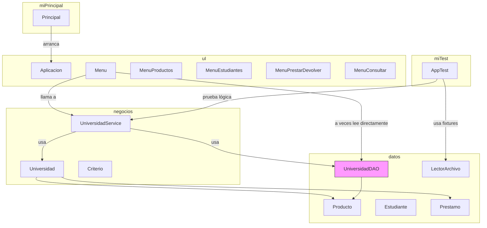

# Diagrama de paquetes (Mermaid)

El siguiente diagrama muestra las dependencias entre los paquetes principales del proyecto: `datos`, `negocios`, `uI`, `miPrincipal` y `miTest`.

Notas:
- Si abres este archivo en GitHub o en VS Code con una extensión de Mermaid, verás el diagrama renderizado.
- Los enlaces "click" apuntan a las rutas de los archivos en el repo y pueden funcionar en algunos visores (VS Code con extensiones).
