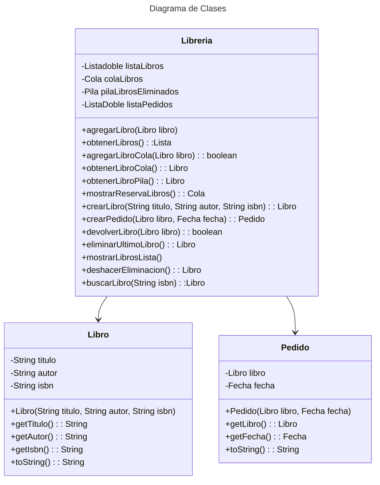

[](https://classroom.github.com/open-in-codespaces?assignment_repo_id=21283418)
# Proyecto - Gestion de Libreria

Este proyecto es una aplicación de consola en Java para gestionar una librería. Permite agregar libros a la lista de prestamos, reservar libros, crear pedidos, y más.

## Funcionalidades

1. **Agregar libro a la lista (Prestar Libros):**
   - Permite agregar un libro a prestamo de la libreria proporcionando el título, autor y ISBN del libro.

2. **Mostrar libros de la lista (Libros Prestados):**
   - Muestra todos los libros que estan Prestados

3. **Agregar libro a la cola (Reserva de Libros):**
   - Permite reservar un libro que exista o no en  la librería y meterno a una cola de reservas

4. **Obtener libro de la cola (Siguiente Libro para Préstamo):**
   - Obtiene y remueve el primer libro de la cola de reservas, siguiendo el principio FIFO (First In, First Out).

5. **Mostrar cola de libros en reserva:**
   - Muestra todos los libros que están actualmente en la cola de reservas.

6. **Elaborar Pedido:**
   - Crea un pedido para un libro, registrando la fecha del pedido.

7. **Devolver libro prestado:**
   - Permite devolver un libro prestado y sacarlo de la cola de libros prestados

8. **Eliminar último libro prestado (Corrección Préstamo):**
   - Elimina el ultimo libro prestado de la libreria, por lo que lo saca de la lista de libros prestados 
   y lo ingresa a una Pila de libros eliminados

9. **Deshacer eliminacion de libro (Restaura operacion de eliminar ultimo prestamo):**
   - Restaura el ultimo libro eliminado sacándolo de la pila y agregando de nuevo a la lista de prestados

## Diagrama de clases
[Editor en línea](https://mermaid.live/)

[Referencia-Mermaid](https://mermaid.js.org/syntax/classDiagram.html)

## Diagrama de clases UML con draw.io
El repositorio está configurado para crear Diagramas de clases UML con ```draw.io```. Para usarlo simplemente agrega un archivo con extensión ```.drawio.png```, das doble clic sobre el mismo y se activará el editor ```draw.io``` incrustado en ```VSCode``` para edición. Asegúrate de agregar las formas UML en el menú de formas del lado izquierdo (opción ```+Más formas```).

## Uso del proyecto con make

### Default - Compilar+Probar+Ejecutar
```
make
```
### Compilar
```
make compile
```
### Probar todo
```
make test
```
### Ejecutar App
```
make run
```
### Limpiar binarios
```
make clean
```
## Comandos Git-Cambios y envío a Autograding

### Por cada cambio importante que haga, actualice su historia usando los comandos:
```
git add .
git commit -m "Descripción del cambio"
```
### Envíe sus actualizaciones a GitHub para Autograding con el comando:
```
git push origin main
```
## Comandos individuales
### Compilar

```
find ./ -type f -name "*.java" > compfiles.txt
javac -d build -cp lib/junit-platform-console-standalone-1.5.2.jar @compfiles.txt
```
Ejecutar ambos comandos en 1 sólo paso:

```
find ./ -type f -name "*.java" > compfiles.txt ; javac -d build -cp lib/junit-platform-console-standalone-1.5.2.jar @compfiles.txt
```


### Ejecutar Todas la pruebas locales de 1 Test Case

```
java -jar lib/junit-platform-console-standalone-1.5.2.jar -class-path build --select-class miTest.AppTest
```
### Ejecutar 1 prueba local de 1 Test Case

```
java -jar lib/junit-platform-console-standalone-1.5.2.jar -class-path build --select-method miTest.AppTest#appHasAGreeting
```
### Ejecutar App
```
java -cp build miPrincipal.Principal
```
Los comandos anteriores están considerados para un ambiente Linux. [Referencia.](https://www.baeldung.com/junit-run-from-command-line)
